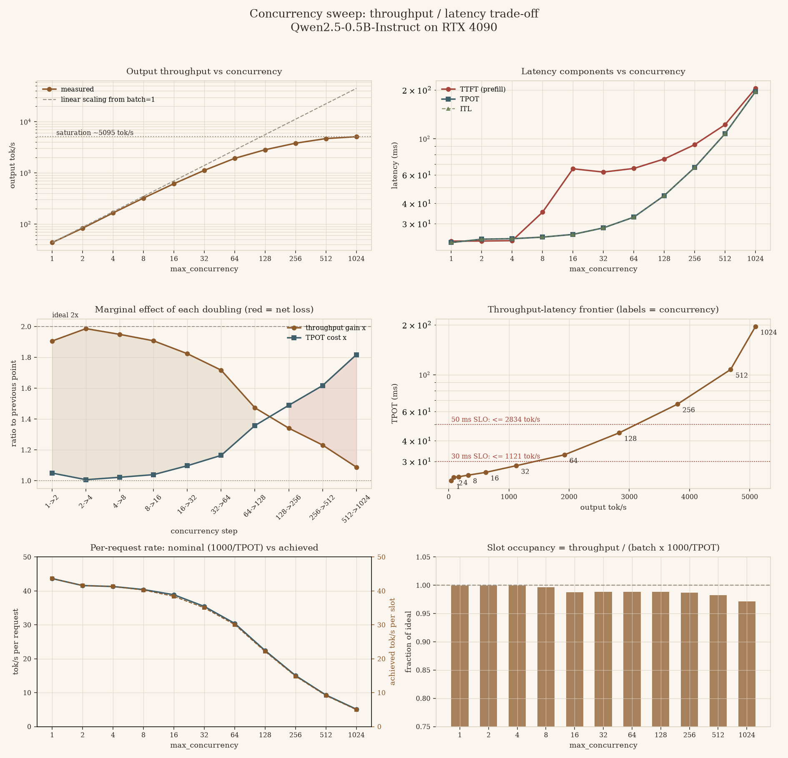

# Performance Analysis — Decode Engine on RTX 4090 (log915 baseline)

> 中文版：[`performance_analysis_log915.zh.md`](./performance_analysis_log915.zh.md)

**Artifacts analysed**

| Artifact | Path |
| --- | --- |
| Concurrency sweep, run 1 | `log_vast/log915/benchmark_baseline/` |
| Concurrency sweep, run 2 | `log_vast/log915/benchmark_baseline2/` |

11 batch sizes (1 → 1 024), the whole sweep run **twice** with no change in between. This report uses
the sweep harness only; the switch matrix in the same log directory is analysed separately in
[`performance_switches_log915.md`](./performance_switches_log915.md).

**Code under test** — `src/qwen/` with every optimisation switch **off**:
`compile_rope = false`, `pre_gather_cos_sin = false`, `stage_sampling_params = false`.

> **This baseline is not the engine's best setting.** `pre_gather_cos_sin` defaults to `True` in
> [`config.py`](../src/qwen/config.py#L114) and the sweep turned it off. The switch report measures
> it as worth **1.6 % of the step at batch 512 and 10.9 % at batch 1**, at no cost anywhere. Every
> absolute number below is that much pessimistic; none of the structural conclusions depend on it.

**Predecessor** — [`performance_analysis_log914.md`](./performance_analysis_log914.md). Three things
differ between the two sweeps; see [§6](#6-what-changed-since-log914) before comparing any number.

---

## Executive summary

1. **Sampling is the engine.** At batch 512 it is **60.4 % of total wall-clock time** and 73 % of
   every decode step; at batch 1 024, 82 % of a decode step. It scales **linearly with batch** —
   1.1 ms at batch 1, 139.8 ms at batch 1 024, a **127×** rise for a 1 024× batch.
2. **The model forward costs ~22 ms whatever you put in it.** `fwd_gpu` moves from 20.5 ms at batch 1
   to 23.5 ms at batch 1 024: **+14 % for 1 024× the tokens**. `rope` inside it is flat to within
   4 % across the entire sweep.
3. **Peak throughput 5 095 tok/s**, and the last profitable doubling now ends at **batch 128** —
   256 already returns 0.70 units of throughput per unit of added latency.
4. **Reproducibility is excellent**: all 11 points agree within **1.21 %** between the two runs, the
   four largest within 0.5 %. Anything below ~1.5 % is noise; every finding here is 5× to 127×.

---

## 1. System under test

### 1.1 Hardware

NVIDIA RTX 4090 (24 GB GDDR6X) on a vast.ai instance — **a different instance from log914's**. Peak
HBM bandwidth 1 008 GB/s; peak BF16 dense (FP32 accumulate) 165.2 TFLOP/s.

### 1.2 Model

Qwen2.5-0.5B-Instruct, `torch.bfloat16`. 494.03 M parameters = 357.9 M body + 136.1 M embedding /
LM head; **0.988 GB** of BF16 weights; 12 KiB of KV per token.

### 1.3 Engine configuration

| Setting | Value |
| --- | --- |
| `max_model_len` | 1 024 |
| `max_num_batched_tokens` | 8 192 |
| `long_prefill_token_threshold` | 8 192 |
| `num_blocks` × `block_size` | 4 096 × 256 → **12.0 GiB** KV |
| `max_num_seqs` | swept 1 → 1 024 |
| `use_d_first_schedule` | **false** |
| Sampling | `do_sample=true`, `do_penalities=true`, `temperature=0.7`, `top_k=20`, `top_p=0.8` |
| Attention | `flash_attn_varlen` (paged) |
| Switches | all off (see the note above) |

---

## 2. Methodology

Synthetic fixed-shape workload: every request is **512 random token ids in, 128 tokens out**, EOS
ignored, `req_num = max(64, 10 × batch)` enqueued up front and drained by `run_to_completion()`.
Closed-loop and saturating, so the reported `queueing` and `ttft` are admission-queue artefacts, not
latency.

**The noise floor is measured, not assumed.** Throughput, run 2 vs run 1:

| batch | 1 | 2 | 4 | 8 | 16 | 32 | 64 | 128 | 256 | 512 | 1024 |
| --- | ---: | ---: | ---: | ---: | ---: | ---: | ---: | ---: | ---: | ---: | ---: |
| Δ | +0.30 % | −0.58 % | −0.78 % | +0.26 % | +1.21 % | −0.40 % | +0.26 % | +0.96 % | +0.36 % | +0.50 % | +0.47 % |

Worst case **1.21 %**, against log914's 5.5 % — the small-batch points, which were the noisy ones
there, are now as tight as the large ones.

This harness is **not** subject to the profiler contamination described in
[`performance_switches_log915.md` §1.2](./performance_switches_log915.md#12-the-profiler-leaves-30-of-host-overhead-behind-in-the-process):
it never enters `torch.profiler`, and its host-side fields are flat across all 11 engine
constructions in a session. Where a number here disagrees with the profile harness, this one is the
one to trust.

---

## 3. Results

### 3.1 Concurrency sweep

| batch | req | tok/s | Δ run 2 | tok/s/req | scaling eff. | gain/cost | TPOT ms | ITL p50 | ITL p99 | ITL max | elapsed s |
| ---: | ---: | ---: | ---: | ---: | ---: | ---: | ---: | ---: | ---: | ---: | ---: |
| 1 | 64 | 43.6 | +0.30 % | 43.63 | 1.00 | — | 22.9 | 22.7 | 27.5 | 40.6 | 187.8 |
| 2 | 64 | 83.2 | −0.58 % | 41.58 | 0.95 | 18.30 | 24.1 | 24.0 | 25.6 | 39.9 | 98.5 |
| 4 | 64 | 165.2 | −0.78 % | 41.30 | 0.95 | 145.56 | 24.2 | 24.1 | 25.9 | 40.8 | 49.6 |
| 8 | 80 | 322.1 | +0.26 % | 40.26 | 0.92 | 42.49 | 24.8 | 24.5 | 28.7 | 32.1 | 31.8 |
| 16 | 160 | 614.3 | +1.21 % | 38.40 | 0.88 | 23.07 | 25.7 | 25.5 | 27.8 | 43.0 | 33.3 |
| 32 | 320 | 1 120.6 | −0.40 % | 35.02 | 0.80 | 8.47 | 28.2 | 27.9 | 33.1 | 68.0 | 36.6 |
| 64 | 640 | 1 924.3 | +0.26 % | 30.07 | 0.69 | 4.37 | 32.9 | 32.0 | 67.9 | 71.1 | 42.6 |
| 128 | 1 280 | 2 834.5 | +0.96 % | 22.14 | 0.51 | **1.32** | 44.6 | 42.8 | 77.4 | 80.1 | 57.8 |
| 256 | 2 560 | 3 801.3 | +0.36 % | 14.85 | 0.34 | **0.70** | 66.5 | 63.3 | 93.8 | 119.8 | 86.2 |
| 512 | 5 120 | 4 681.7 | +0.50 % | 9.14 | 0.21 | 0.38 | 107.5 | 102.5 | 129.0 | 256.7 | 140.0 |
| 1024 | 10 240 | 5 094.6 | +0.47 % | 4.98 | 0.11 | 0.11 | 195.3 | 204.3 | 223.0 | 488.6 | 257.3 |



*The same run, drawn. Three panels carry what the table cannot: **top-left**, the shape of the
departure from linear scaling and the 5 095 tok/s ceiling; **middle-left**, the throughput gain and
the TPOT cost of each doubling crossing over — the red area is where a doubling is a net loss;
**middle-right**, the throughput reachable under a latency budget (≤ 2 834 tok/s at a 50 ms TPOT SLO,
≤ 1 121 tok/s at 30 ms), which appears nowhere in the numbers above. The bottom row is a soundness
check: slot occupancy stays at 0.97–1.00, so none of this is a queueing artefact.*

*Configuration is the pessimistic one — all switches off, `pre_gather_cos_sin=false` included (see the
note at the top). Run 2 gives the same figure, beside it as `…run2.png`. Regenerate with*

```bash
python benchmark/tool/bench_viz.py --log-dir=log_vast/log915/benchmark_baseline \
  --out=$PWD/docs/attachments/concurrency_sweep.log915.baseline.run1.png
```

*which also writes a `.txt` report of the same numbers next to the figure.*

* **The last profitable doubling ends at batch 128** (throughput gain ÷ TPOT cost > 1). Past it you
  buy 34 % more throughput for 49 % more latency, then 23 % for 62 %, then 9 % for 82 %.
* **TPOT is flat from batch 1 to 16** (22.9 → 25.7 ms): 16× the work for 12 % more time. That is a
  fixed per-step overhead, not a loaded GPU.
* **Tail from prefill/decode co-scheduling.** At batch 64, TPOT is 32.9 ms but ITL p99 is **67.9 ms**
  — a decode token that lands in a step also carrying a prefill chunk costs ~2×. ITL max reaches
  488.6 ms at batch 1 024.
* Zero preemptions, zero cache exhaustions, zero rescheduled requests at every point in both runs.

### 3.2 Per-step CPU breakdown (pure-decode steps, run 1)

| batch | sched | bld_meta | fwd | *(of which rope)* | logits | **sample** | dth | ci | **total** |
| ---: | ---: | ---: | ---: | ---: | ---: | ---: | ---: | ---: | ---: |
| 1 | 0.16 | 0.21 | 20.53 | 6.11 | 0.12 | **1.36** | 0.03 | 0.01 | **22.69** |
| 8 | 0.17 | 0.22 | 21.77 | 6.15 | 0.12 | **1.94** | 0.03 | 0.01 | **24.55** |
| 32 | 0.23 | 0.26 | 22.57 | 6.24 | 0.13 | **4.20** | 0.03 | 0.03 | **27.73** |
| 64 | 0.31 | 0.32 | 22.46 | 6.24 | 0.14 | **8.17** | 0.05 | 0.06 | **31.80** |
| 128 | 0.47 | 0.45 | 22.75 | 6.24 | 0.13 | **17.90** | 0.34 | 0.12 | **42.47** |
| 256 | 0.77 | 0.67 | 22.63 | 6.26 | 0.13 | **36.44** | 1.20 | 0.25 | **62.41** |
| 512 | 1.51 | 1.09 | 22.50 | 6.29 | 0.13 | **71.47** | 2.63 | 0.49 | **100.17** |
| 1024 | 3.21 | 1.85 | 23.32 | 6.36 | 0.13 | **136.27** | 5.24 | 0.92 | **171.31** |

`fwd` is constant across a 1 024× range of batch size; `rope` is constant at ~6.2 ms, **28 % of
`fwd`**, for an operation whose arithmetic content is a handful of multiply-adds; `sample` is linear
in batch at ~133 µs per sequence and overtakes `fwd` between batch 128 and 256.

### 3.3 Scaling of each component, relative to batch 1

| batch | step | `fwd_gpu` | `rope` | `sample` | `dth` | `sched` | `ci` | `logits_gpu` |
| ---: | ---: | ---: | ---: | ---: | ---: | ---: | ---: | ---: |
| 8 | 1.08 | 1.06 | 1.01 | 1.43 | 1.00 | 1.09 | 1.48 | 1.03 |
| 32 | 1.22 | 1.10 | 1.02 | 3.10 | 1.04 | 1.47 | 3.16 | 1.08 |
| 128 | 1.87 | 1.11 | 1.02 | 13.21 | 11.70 | 2.97 | 11.92 | 1.18 |
| 512 | 4.41 | 1.10 | 1.03 | 52.74 | 91.01 | 9.53 | 48.62 | 2.65 |
| 1024 | 7.55 | **1.14** | **1.04** | **100.56** | 181.72 | 20.23 | 90.26 | 4.58 |

Two columns tell the whole story: the model forward is **flat** where it should scale, and sampling
is **linear** where it should not have to be.

### 3.4 Where the whole run goes

Summing every step and attributing by device-side window (seconds):

| batch | prefill `fwd` | prefill sampling | decode `fwd` | decode sampling | host | total | **sampling % of run** |
| ---: | ---: | ---: | ---: | ---: | ---: | ---: | ---: |
| 128 | 5.3 | 0.8 | 27.2 | 21.4 | 2.0 | 57.3 | **38.9 %** |
| 256 | 11.3 | 3.2 | 25.4 | 41.9 | 3.0 | 85.6 | **52.7 %** |
| 512 | 27.0 | 13.5 | 21.7 | 70.7 | 5.3 | 139.3 | **60.4 %** |
| 1024 | 79.5 | 63.7 | 14.5 | 86.5 | 9.8 | 256.3 | **58.6 %** |

```
sampling % of run = Σ sample_gpu (every step, prefill and decode) / Σ step (every step)
```

(The columns do not sum to the total: `logits_gpu` — 1.2 s at batch 512 — is omitted. See
[log914 §2.6](./performance_analysis_log914.md#26-notation--sample-sample_gpu-and-sampling) for what
`sample`, `sample_gpu` and "sampling" each mean.)

**Prefill steps pay the sampling bill twice.** A chunked-prefill step samples every running decode
row as well as its own new sequences: at batch 1 024, prefill steps are 54 % of all steps and
**63.7 s of their 149 s is sampling**, against 79.5 s of genuine prefill compute.

### 3.5 Roofline position

| | batch 1 | batch 512 | batch 1024 |
| --- | ---: | ---: | ---: |
| Weight traffic per decode step | 0.988 GB | 0.988 GB | 0.988 GB |
| Achieved | 43.5 GB/s | 9.9 GB/s | 5.8 GB/s |
| **MBU** (vs 1 008 GB/s) | **4.3 %** | 1.0 % | 0.6 % |
| **MFU** (decode, vs 165.2 TFLOP/s) | 0.2 % | 1.4 % | **2.6 %** |

`bench_viz.py` reports **3.1 % MFU** for this same run rather than the 2.6 % above: it counts all
494 M parameters (the LM head included) against the run-average throughput, where this table counts
the 357.9 M body against the decode step alone. Both are right about what they measure — quote the
definition with the number.

Utilisation gets *worse* with batch, because the step grows while the weight read does not. For
contrast, the two pieces that are doing real work: **prefill reaches 70 TFLOP/s (42 % MFU)** on
8 192-token steps, and the **LM head hits 146 TFLOP/s (88 % MFU)** at batch 512.

---

## 4. Bottlenecks, ranked by what they cost

### 4.1 Sampling — 60.4 % of the run at batch 512

**Evidence.** `sample_gpu` is 73.2 ms of a 100.2 ms decode step at batch 512 and 139.8 ms of 171.3 ms
at batch 1 024 — device-side, so real kernel work. Including mixed steps, sampling is 84.2 s of the
139.3 s run at batch 512. It scales **100× for a 1 024× batch** while every other per-step cost stays
flat or grows sublinearly.

**Root cause — two full-vocabulary passes per step.**

* [`apply_top_p`](../src/qwen/sampling.py#L200) sorts the complete 151 936-wide row for every
  sequence — a **78 M-element sort** at batch 512, 156 M at batch 1 024, every step.
* [`apply_penalties`](../src/qwen/sampling.py#L157) materialises `[batch, vocab]` fp32 tensors;
  `rep_pen[:, None].repeat(1, vocab_size)` alone is 311 MB at batch 512 and **622 MB at batch 1 024**,
  written and re-read each step, then ~7 more full passes over it.

**Fix.** Cut to the candidate set first: with `top_k = 20`, top-p needs the 20 survivors ranked, not
151 936. `torch.topk(logits, k)` → sort / softmax / `multinomial` over *k* → scatter back. Penalties
on gathered candidates, or fused into the logits pass.

**Upside.** ≈**2× end-to-end throughput** at batch 512 for a 5× reduction in sampling, and it pays a
second time through the prefill steps in §3.4.

### 4.2 The model forward costs ~22 ms whatever you put in it

**Evidence.** `fwd_gpu` is 20.50 ms at batch 1 and 23.47 ms at batch 1 024 — **+14 % for 1 024× the
tokens**. A prefill step carrying 7 511 tokens spends 77.3 ms, i.e. 3.4× the work of a batch-1024
decode step for 7× the tokens, which is the only place in this sweep where the forward behaves like
compute at all.

At batch 1 that flat cost is **90 % of the step** and it caps the engine at 43.6 tok/s single-stream.
`rope` alone is 6.2 ms of it — 28 %, flat across the sweep.

**Root cause.** Eager per-layer dispatch: 24 layers × ~12 kernels, each paying Python, dispatch and
launch. The [profile harness](./performance_switches_log915.md) measures the GPU idle 50–85 % of a
decode step, which is the same statement from the device side.

**Fix.** CUDA-graph the decode path (shapes are static once the batch is fixed), or
`torch.compile(mode="reduce-overhead")`. This is the only change that improves single-stream latency.
Note that kernel-level tuning **cannot** help here and measurably hurts: `compile_rope` removes
0.4 ms of GPU work and adds 1–4 ms of wall time.

### 4.3 The token read-back blocks, and grows faster than the batch

`dth` — the `next_tokens.tolist()` in [`engine.forward`](../src/qwen/engine.py#L71) — goes from
0.03 ms at batch 1 to **5.24 ms at batch 1 024**, a **182×** rise, and it is a hard synchronisation
point. Two more blocking syncs sit inside sampling itself (`.item()` in `apply_top_k`, `dead.any()`
in `sample`).

Fix after §4.1 and §4.2: stage through pinned memory on a side stream, or keep the ids on device
until the scheduler needs them.

### 4.4 Per-request Python in the scheduler path

`sched + bld_meta + ci` grows 20×, 9× and 90× respectively from batch 1 to 1 024, reaching 5.98 ms —
**3.5 % of the step**. Small today, but it is the only cost besides sampling that scales with batch,
so it becomes the next ceiling once §4.1 lands.

---

## 5. What is *not* a bottleneck

* **The LM head.** `logits_gpu` is 0.956 ms at batch 512 for a 139 GFLOP matmul — **146 TFLOP/s,
  88 % of the card's BF16 peak.** The best-utilised kernel in the engine.
* **Prefill compute.** 8 192 tokens in ~77 ms is **70 TFLOP/s (42 % MFU)**. Healthy; the deficit is
  orchestration, not arithmetic.
* **Scheduler policy and the KV cache.** Zero preemptions, zero cache exhaustions, zero rescheduled
  requests across 11 batch sizes × 2 runs.
* **The reported TTFT.** A closed-loop artefact — all requests are enqueued at t=0 and only `batch`
  of them run at once. The meaningful figure is `prefill` (23.4 ms at batch 1, 204.5 ms at 1 024).

---

## 6. What changed since log914

Three things moved at once, so the two sweeps are **not** directly comparable:

| | log914 | log915 |
| --- | --- | --- |
| `pre_gather_cos_sin` | declared false but **ignored by the code** — the pre-gathered path ran | false and **honoured** — the per-layer path ran |
| `use_d_first_schedule` | true | false |
| Host | one vast.ai instance | another |
| tok/s @ 1024 | 5 300 | 5 095 (−3.9 %) |
| `rope` @ 512 | 4.31 ms | 6.29 ms (+46 %) |
| decode step @ 512 | 92.35 ms | 100.17 ms (+8.5 %) |

* **The `rope` regression is the flag, not the code.** log914's "baseline" was running with
  pre-gather on without knowing it. The comparable log915 configuration is the `pre_gather` arm of
  the switch matrix, not this baseline.
* **The schedule flag is not a confound.** At batch 512 both sweeps produce exactly 349 prefill and
  965 decode steps — under a saturating closed-loop load with everything enqueued up front,
  D-first and interleaved scheduling reach the same step composition.
* **The host is a real variable.** This engine is launch-bound, so host CPU speed moves the step time
  more than any switch measured so far. Recording `torch.cuda.get_device_name()`, the driver, the
  torch version and the CPU model in the metrics header would make these logs self-describing; today
  the hardware identity has to be carried in prose.

---

## 7. Recommendations, in order

1. **Rewrite the sampling path to work on the candidate set** (§4.1). The only change that moves
   throughput by a multiple, and it pays twice through prefill steps. ≈2× at batch 512.
2. **CUDA-graph the decode step** (§4.2). The only change that improves latency, and the prerequisite
   for every kernel-level optimisation to have the sign you expect.
3. **Turn `pre_gather_cos_sin` back on** — free, already the `config.py` default, and worth 1.6–10.9 %
   of the step. Re-run this sweep with it on; the numbers above are pessimistic by that much.
4. **Un-block the token read-back** (§4.3), once the step is short enough for 5 ms to matter.
5. **Record the host identity in the metrics header** (§6), before the next instance is rented.

---

## 8. Caveats

* Both sweeps ran on the same instance within 40 minutes; no cross-machine reproduction of *this*
  configuration.
* `sampling % of run` attributes by device-side window, which counts stream gaps inside the window.
  At batch ≥ 256 the GPU is well fed and the error is small; below batch 128 it is not, so that
  column is only quoted from 128 up.
* The workload is synthetic (random ids, fixed 512/128). Random ids change the penalty mask density
  versus real text, which affects §4.1's memory traffic but not its asymptotics.
* MBU/MFU treat the decode step as reading the full 0.988 GB of weights once, which is exact for the
  body but ignores KV traffic (12 KiB per token per step — 6 MB at batch 512, negligible beside the
  weights).
